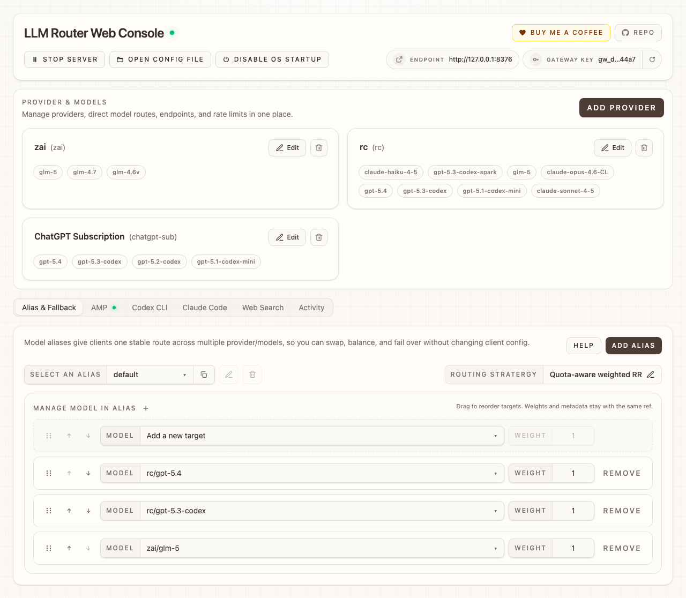
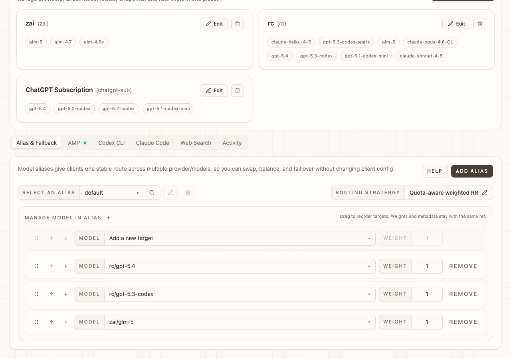
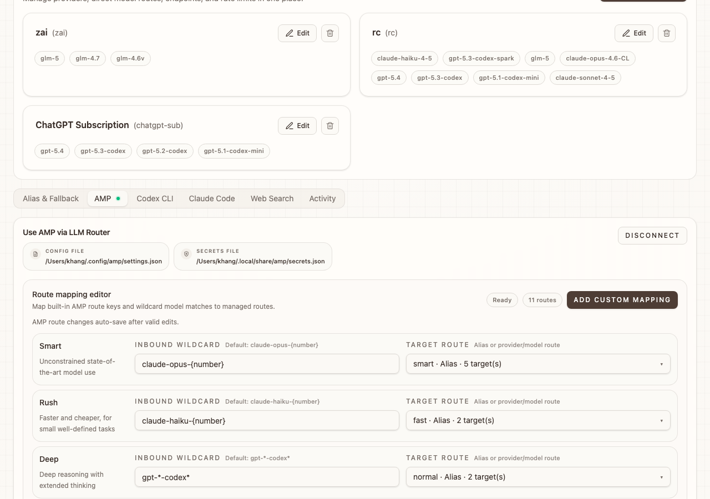
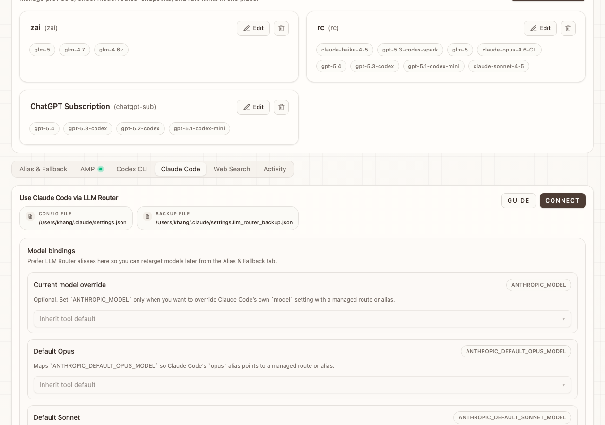
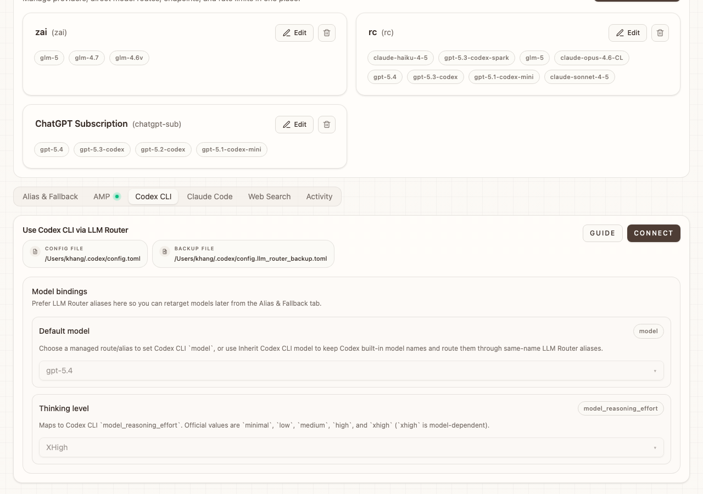
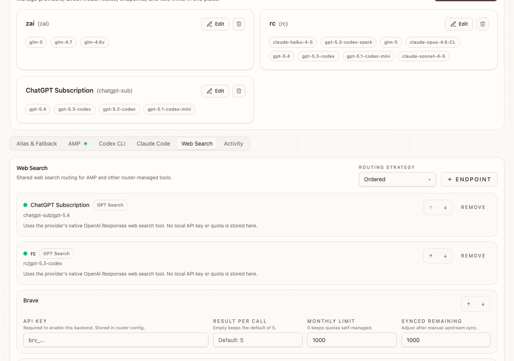

# LLM Router

LLM Router is a local and Cloudflare-deployable gateway for routing one client endpoint across multiple LLM providers, models, aliases, fallbacks, and rate limits.



**Current version**: `2.2.0`

NPM package:
```bash
@khanglvm/llm-router
```

Primary CLI command:
```bash
llr
```

## Install

```bash
npm i -g @khanglvm/llm-router@latest
```

## Quick Start

1. Open the Web UI:

```bash
llr
```

2. Add at least one provider and model.
3. Optionally create aliases and fallback routes.
4. Start the local gateway:

```bash
llr start
```

5. Point your client or coding tool at the local endpoint.

## Supported Operator Flows

- CLI: direct operations like `llr config --operation=...`, `llr start`, `llr deploy`, provider diagnostics, and coding-tool routing control
- Web UI: browser-based config editing, provider probing, and local router control

The legacy TUI flow is no longer part of the supported workflow.

## Core Commands

Open the Web UI:

```bash
llr
llr config
llr web
```

Run direct config operations:

```bash
llr config --operation=validate
llr config --operation=snapshot
llr config --operation=tool-status
llr config --operation=list
llr config --operation=discover-provider-models --endpoints=https://openrouter.ai/api/v1 --api-key=sk-...
llr config --operation=test-provider --endpoints=https://openrouter.ai/api/v1 --api-key=sk-... --models=gpt-4o-mini,gpt-4o
llr config --operation=upsert-provider --provider-id=openrouter --name=OpenRouter --base-url=https://openrouter.ai/api/v1 --api-key=sk-... --models=gpt-4o-mini,gpt-4o
llr config --operation=upsert-model-alias --alias-id=chat.default --strategy=auto --targets=openrouter/gpt-4o-mini@3,anthropic/claude-3-5-haiku@2
llr config --operation=set-provider-rate-limits --provider-id=openrouter --bucket-name="Monthly cap" --bucket-models=all --bucket-requests=20000 --bucket-window=month:1
llr config --operation=set-master-key --generate-master-key=true
llr config --operation=set-codex-cli-routing --enabled=true --default-model=chat.default
llr config --operation=set-claude-code-routing --enabled=true --primary-model=chat.default
llr config --operation=set-amp-client-routing --enabled=true --amp-client-settings-scope=workspace
```

Operate the local gateway:

```bash
llr start
llr stop
llr reclaim
llr reload
llr update
```

Get the agent-oriented setup brief:

```bash
llr ai-help
```

## Web UI

The Web UI is the default operator surface.

```bash
llr
llr web --port=9090
llr web --open=false
```

What it covers:

- raw JSON config editing with validation
- provider discovery and probe flows
- alias, fallback, rate-limit, and AMP management
- local router start, stop, and restart
- coding-tool patch helpers for Codex CLI, Claude Code, and AMP

The Web UI is localhost-only by default because it can expose secrets and live configuration.

### Screenshots

**Alias & Fallback**



**AMP Configuration**



**Claude Code Routing**



**Codex CLI Routing**



**Web Search**



## CLI Parity

The browser UI still gives the best interactive overview, but the CLI now exposes the main management flows an agent needs without relying on private web endpoints.

```bash
llr config --operation=validate
llr config --operation=snapshot
llr config --operation=tool-status
llr reclaim
llr config --operation=set-codex-cli-routing --enabled=true --default-model=chat.default
llr config --operation=set-claude-code-routing --enabled=true --primary-model=chat.default --default-haiku-model=chat.fast
llr config --operation=set-amp-client-routing --enabled=true --amp-client-settings-scope=workspace
llr config --operation=set-codex-cli-routing --enabled=false
llr config --operation=set-claude-code-routing --enabled=false
llr config --operation=set-amp-client-routing --enabled=false --amp-client-settings-scope=workspace
```

Notes:

- `validate` checks raw config JSON + schema without opening the Web UI.
- `snapshot` combines config, runtime, startup, and coding-tool routing state.
- `tool-status` focuses only on Codex CLI, Claude Code, and AMP client wiring.
- `reclaim` force-frees the fixed local router port when another listener is blocking `llr start`.
- `set-codex-cli-routing` accepts `--default-model=<route>` or `--default-model=__codex_cli_inherit__` to keep Codex's own model selection.
- `set-claude-code-routing` accepts `--primary-model`, `--default-opus-model`, `--default-sonnet-model`, `--default-haiku-model`, `--subagent-model`, and `--thinking-level`.
- `set-amp-client-routing` patches or restores AMP client settings/secrets separately from router-side AMP config.

## Providers, Models, and Aliases

- Provider: one upstream service such as OpenRouter or Anthropic
- Model: one upstream model id exposed by that provider
- Alias: one stable route name that can fan out to multiple provider/model targets
- Rate-limit bucket: request cap scoped to one or more models over a time window

Recommended pattern:

1. Add providers with direct model lists.
2. Create aliases for stable client-facing route names.
3. Put balancing/fallback behavior behind the alias, not in the client.

## Subscription Providers

OAuth-backed subscription providers are supported.

```bash
llr config --operation=upsert-provider --provider-id=chatgpt --name="GPT Sub" --type=subscription --subscription-type=chatgpt-codex --subscription-profile=default
llr config --operation=upsert-provider --provider-id=claude-sub --name="Claude Sub" --type=subscription --subscription-type=claude-code --subscription-profile=default
llr subscription login --subscription-type=chatgpt-codex --profile=default
llr subscription login --subscription-type=claude-code --profile=default
llr subscription status
```

Supported `subscription-type` values:

- `chatgpt-codex`
- `claude-code`

Compliance note: using provider resources through LLM Router may violate a provider's terms. You are responsible for that usage.

## AMP

LLM Router can front AMP-compatible routes locally and optionally proxy unresolved AMP traffic upstream.

Open the Web UI for AMP setup, or use direct CLI operations:

```bash
llr config --operation=set-amp-config --patch-amp-client-config=true --amp-client-settings-scope=workspace --amp-client-url=http://127.0.0.1:4000
llr config --operation=set-amp-config --amp-default-route=chat.default --amp-routes="smart => chat.smart, rush => chat.fast"
llr config --operation=set-amp-config --amp-upstream-url=https://ampcode.com --amp-upstream-api-key=amp_...
llr config --operation=set-amp-client-routing --enabled=true --amp-client-settings-scope=workspace
```

## Local Real-Provider Suite

The repo includes a local-only real-provider suite for the supported operator surfaces:

- CLI config + local gateway start
- Web UI discovery / probe / save / router control

Setup:

```bash
cp .env.test-suite.example .env.test-suite
```

Then fill in your own provider keys, endpoints, and models.

Run:

```bash
npm run test:provider-live
```

Legacy alias:

```bash
npm run test:provider-smoke
```

The live suite uses isolated temp HOME/config/runtime-state folders and does not overwrite your normal `~/.llm-router.json` or `~/.llm-router.runtime.json`.

## Deploy to Cloudflare

Deploy the current config to a Worker:

```bash
llr deploy
llr deploy --dry-run=true
llr deploy --workers-dev=true
llr deploy --route-pattern=router.example.com/* --zone-name=example.com
llr deploy --generate-master-key=true
```

Fast worker key rotation:

```bash
llr worker-key --generate-master-key=true
llr worker-key --env=production --master-key=rotated-key
```

## Config File

Local config path:

```text
~/.llm-router.json
```

LLM Router also keeps related runtime and token state under the same namespace for backward compatibility with the published package.

Useful runtime env knobs:

- `LLM_ROUTER_MAX_REQUEST_BODY_BYTES`: caps inbound JSON body size for the local router and worker runtime. Default is `8 MiB` for `/responses` requests and `1 MiB` for other JSON endpoints.
- `LLM_ROUTER_UPSTREAM_TIMEOUT_MS`: overrides the provider request timeout.

## Development

Web UI dev loop:

```bash
npm run dev
```

Build the browser bundle:

```bash
npm run build:web-console
```

Run the JavaScript test suite:

```bash
node --test $(rg --files -g "*.test.js" src)
```

## Documentation

Comprehensive documentation is available in the `docs/` directory:

- **[Project Overview & PDR](./docs/project-overview-pdr.md)** — Feature matrix, target users, success metrics, constraints
- **[Codebase Summary](./docs/codebase-summary.md)** — Directory structure, module relationships, entry points, test infrastructure
- **[Code Standards](./docs/code-standards.md)** — Patterns, naming conventions, testing, error handling
- **[System Architecture](./docs/system-architecture.md)** — Request lifecycle, subsystem boundaries, data flow, deployment models
- **[Project Roadmap](./docs/project-roadmap.md)** — Current status, planned phases, timeline, success metrics

## Security and Releases

- Security: [`SECURITY.md`](https://github.com/khanglvm/llm-router/blob/master/SECURITY.md)
- Release notes: [`CHANGELOG.md`](https://github.com/khanglvm/llm-router/blob/master/CHANGELOG.md)
- AMP routing: [`docs/amp-routing.md`](./docs/amp-routing.md)
